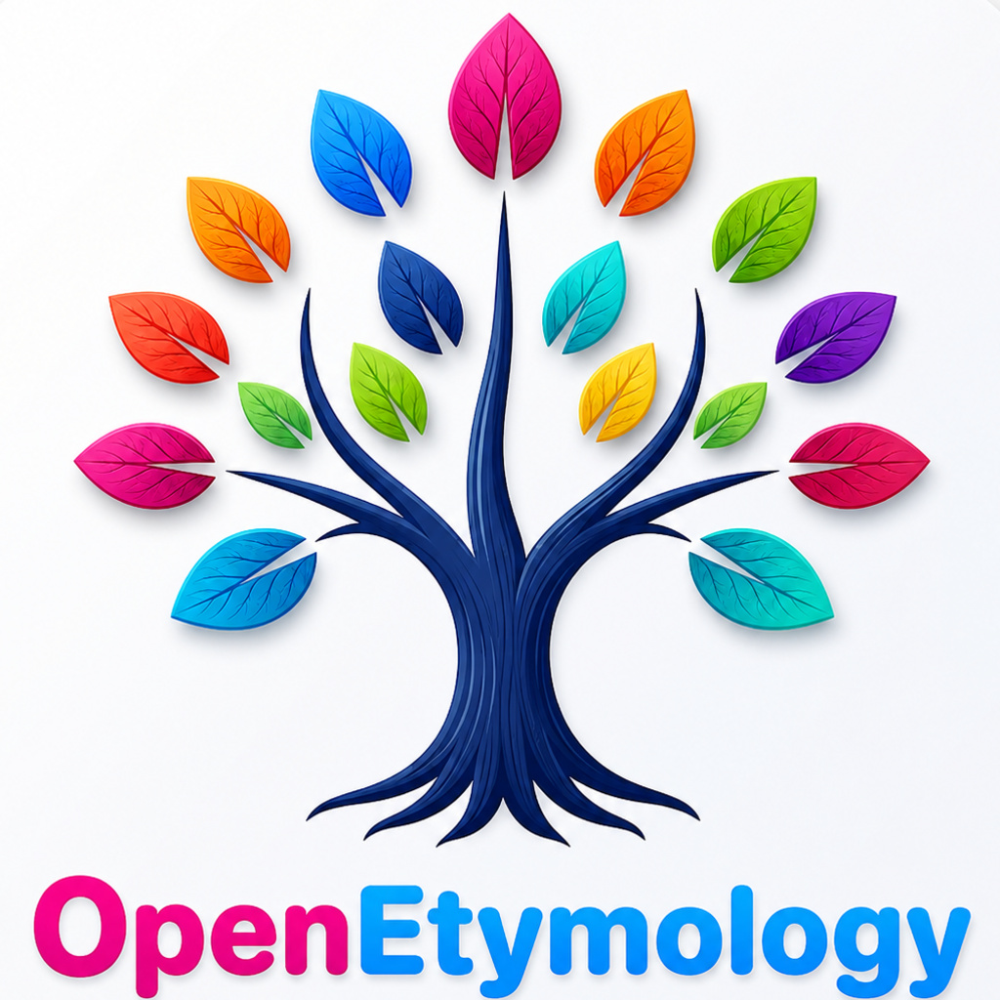

<p align="center">
  
</p>

# 词源英语OpenEtymology | 英语词源词根词缀单词本

English vocabulary wordbooks with etymology, word roots, prefixes and suffixes for CET4, CET6, TEM8, TOEFL and GRE.

词源英语OpenEtymology 是一个面向英语考试和长期词汇学习的开源单词本集合，提供 PDF / EPUB / TXT 格式，包含词源、词根、词缀、中文释义和双语例句。

这里提供 CET4、CET6、TEM8、TOEFL、GRE8000 五个单词本，每个单词本都单独发布。你可以直接阅读，也可以基于这些词表做自己的学习工具。

完整 App 已在 App Store 上架：

[](https://apps.apple.com/us/app/openetymology/id6769062051?l=zh-Hans-CN)

对应的网页版可以访问：[www.openetymology.com](https://www.openetymology.com)

## 为什么做这个项目

很多人背单词时会遇到同一个问题：今天记住了中文释义，过几天又忘了；看到熟词能认出来，换到阅读、写作、听力场景里又反应不过来。

词源英语OpenEtymology 想解决的不是“再给你一份更长的单词表”，而是把单词重新放回它本来的结构里：

- **词源**：理解一个词最初从哪里来，为什么会发展成现在的意思。
- **词根**：把看似陌生的长词拆成更小、更稳定的意义单元。
- **词缀**：通过前缀、后缀判断方向、否定、动作、名词化、形容词化等语义变化。
- **例句**：把词放回真实表达场景，而不是只记一个孤立中文释义。

英语单词并不是随机字母组合。很多词背后都有清晰的来源和派生逻辑。比如同一个词根会在多个单词中反复出现；同一个前缀会稳定地表达“否定”“向前”“再次”“共同”等意义。掌握这些结构之后，背单词会从“硬记答案”变成“理解线索”。

## 词根词缀怎么帮助记忆

下面是词源英语OpenEtymology 词库里的几个例子：

### android：像人的东西

`android` 的意思是“机器人，尤指类人形机器人”。它可以拆成：

```text
android = andr<人> + oid<类似...的>
```

其中 `andr` 来自希腊语，表示“人”或“人类”；`-oid` 表示“像……的、具有……形状的”。所以 `android` 的字面线索就是“像人的东西”。这样记忆时，它不再只是一个科技产品名，而是能自然联想到“模仿人类形态与行为的机器”。

### entrepreneur：进入风险、主动承担的人

`entrepreneur` 的意思是“企业家，组织和管理企业并承担风险的人”。词条中把它拆成：

```text
entrepreneur = entre<介于/进入> + pre<前> + neur<承担者>
```

`entre-` 有“进入、介入”的方向感，`pre-` 带有“在前、提前”的意味，`-neur` 指向“行动者、承担者”。把这些线索连起来，`entrepreneur` 就不只是“企业家”这个中文标签，而是“进入新领域、提前判断机会、承担风险并行动的人”。

### etymology：研究词的真实含义

`etymology` 本身就很适合解释“词源学习”这件事。它可以拆成：

```text
etymology = etymo<真实含义> + logy<学科>
```

`etymo` 来自希腊语，和“真实含义、词源”有关；`-logy` 常见于学科名称，比如 `biology`、`psychology`。所以 `etymology` 的字面含义就是“研究词语真实来源和含义的学科”。这也是这个项目的核心思路：通过拆解语素，还原单词背后的演变逻辑和记忆线索。

## 适合谁

这个仓库适合：

- 准备 CET4 / CET6 / TEM8 / TOEFL / GRE 的学习者
- 想用词源、词根、词缀理解单词的人
- 想把单词本导入 Kindle、Apple Books、微信读书等阅读工具的人
- 想基于公开词表做学习工具、记忆卡片或个人词典的开发者

## 这个版本提供什么

每个单词本尽量保留适合学习的结构化内容，包括：

- 单词与音标
- 中文释义
- 词根、词缀、构词拆解
- 词源说明
- 双语例句
- 适合阅读器使用的 PDF / EPUB 格式

## 单词本

| 单词本 | 单词数 | TXT | PDF | EPUB |
|---|---:|---|---|---|
| CET4 | 4,533 | [CET4.txt](./CET4/CET4.txt) | [CET4.pdf](./CET4/CET4.pdf) | [CET4.epub](./CET4/CET4.epub) |
| CET6 | 2,219 | [CET6.txt](./CET6/CET6.txt) | [CET6.pdf](./CET6/CET6.pdf) | [CET6.epub](./CET6/CET6.epub) |
| TEM8 | 3,984 | [TEM8.txt](./TEM8/TEM8.txt) | [TEM8.pdf](./TEM8/TEM8.pdf) | [TEM8.epub](./TEM8/TEM8.epub) |
| TOEFL | 4,510 | [TOEFL.txt](./TOEFL/TOEFL.txt) | [TOEFL.pdf](./TOEFL/TOEFL.pdf) | [TOEFL.epub](./TOEFL/TOEFL.epub) |
| GRE8000 | 7,728 | [GRE8000.txt](./GRE8000/GRE8000.txt) | [GRE8000.pdf](./GRE8000/GRE8000.pdf) | [GRE8000.epub](./GRE8000/GRE8000.epub) |

原始词条合计：22,974  
五个单词本合并去重后：14,157

## 示例 App

[`SampleApp`](./SampleApp/) 中提供了一个 SwiftUI 示例 App，用来展示 OpenEtymology 的搜索、阅读和练习流程。

示例 App 只包含：

- 500 词 EN-CN 演示 SQLite 数据库
- 500 词 EN-EN 演示 SQLite 数据库
- 公开考试词表文本文件
- 无真实商品 ID 的演示 StoreKit stub

## 不包含什么

这个仓库不包含：

- OpenEtymology 完整 50,000+ 词生产词典数据库
- 完整 EN-CN / EN-EN 生产 SQLite 文件
- App Store 生产配置
- 真实 StoreKit 商品 ID 或购买逻辑
- OpenEtymology Plus 商业功能

每个单词本都单独发布，以保留各自的学习场景。本仓库故意不提供五个单词本的合并总表。

## 开源范围

- 代码：见 [LICENSE](./LICENSE)
- 单词本数据：见 [DATA_LICENSE.md](./DATA_LICENSE.md)

欢迎提交 issue 反馈释义、词源、例句、格式或阅读体验问题。
